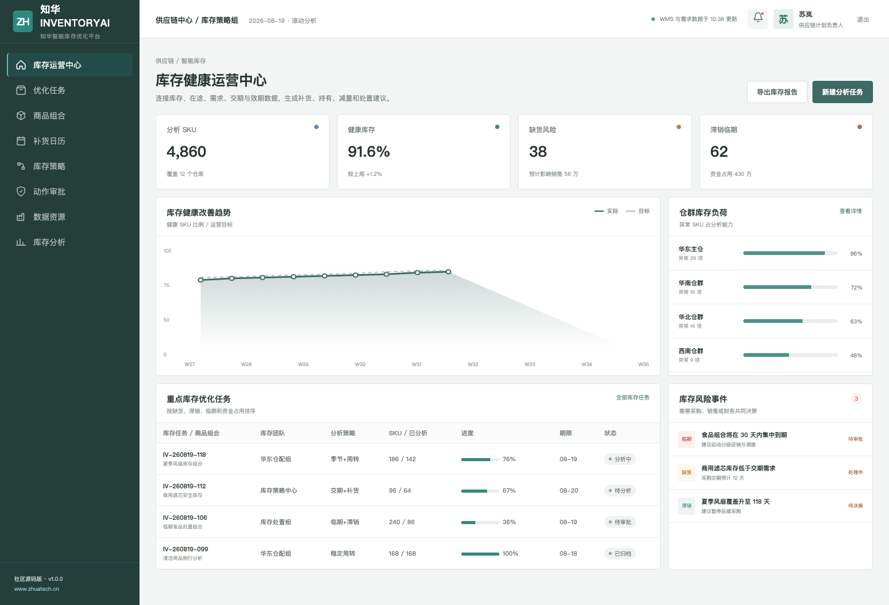
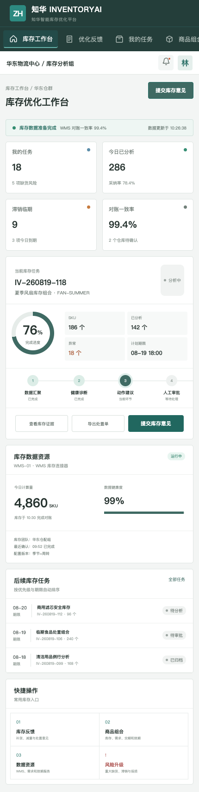

<div align="center">

# ZhuaTech InventoryAI

### 智能库存健康、补货与滞销处置社区版

[知华科技官网](https://www.zhuatech.cn/) · 上海如静知华信息科技有限公司

</div>

InventoryAI 连接库存、在途、日均需求、采购交期、最后销售时间、效期和毛利数据，把分散的库存数字转换为 `REPLENISH / HOLD / REDUCE / LIQUIDATE` 四类可解释动作。



## 从库存诊断到业务动作

| 业务问题 | 项目能力 |
| --- | --- |
| 会不会缺货 | 交期需求、安全缓冲、建议补货点与补货量 |
| 库存是否过量 | 库存覆盖天数和减量信号 |
| 是否已经滞销 | 长期无销售、超高覆盖和毛利信号 |
| 是否临期 | 剩余效期风险和人工处置审批 |

核心接口：`POST /api/ai/inventory/optimize`。默认实现完全本地运行，不需要外部模型密钥。



## 项目组成

- 库存运营驾驶舱、仓群负荷和重点风险队列
- 商品组合、补货日历、库存策略、动作审批和健康分析
- 响应式业务工作台、库存反馈和重大风险升级
- Java 21、Spring Boot 4、JPA、MySQL、Flyway、JWT
- Vue 3、Pinia、Vue Router、Axios、Vite、Docker Compose
- JUnit、MockMvc、H2 和自动化构建配置

```bash
cd frontend
npm install
npm run dev:demo
```

访问 `http://localhost:5173`，管理端 `planner / Demo@2026`，分析师端 `operator / Demo@2026`。演示商品、库存、金额和人员均为虚构数据。后端包名：`cn.zhuatech.inventoryai`。

资料：[API](docs/api.md) · [架构](docs/architecture.md) · [数据库](docs/database.md) · [部署](deploy/README.md)

> [!WARNING]
> 本工程仅限个人非商业学习与技术交流，不得商用。企业内部部署、生产使用、SaaS、客户交付、品牌替换和收费服务须事先取得上海如静知华信息科技有限公司书面授权，详见 [LICENSE](LICENSE)。

需要 WMS/ERP/OMS 集成、库存优化、供应链 AI、软件外包或私有化开发，请联系[知华科技](https://www.zhuatech.cn/)：

| 方案咨询 | 商业合作 |
| --- | --- |
|  |  |

SEO：智能库存、库存优化、AI 补货、滞销库存、临期管理、Java Vue 源码、知华科技。
